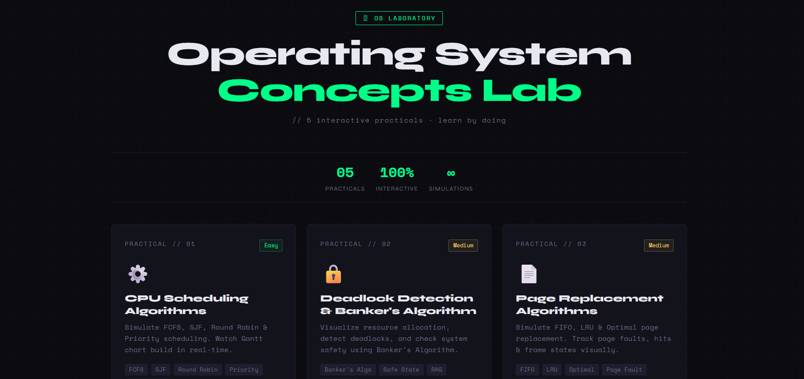

# 🖥 OS Laboratory

> Interactive Operating System practicals and simulations built for students to learn core OS concepts visually through modern browser-based labs.

## 📌 Description

**OS Laboratory** is a modern educational web project designed to simplify Operating System concepts using interactive simulations and practical implementations.

It includes:

- ⚙️ CPU Scheduling Algorithms (FCFS, SJF, Round Robin, Priority)
- 🔒 Deadlock Detection & Banker's Algorithm
- 📄 Page Replacement Algorithms (FIFO, LRU, Optimal)
- 💾 Disk Scheduling Algorithms (FCFS, SSTF, SCAN, C-SCAN)
- 🔢 Memory Allocation & Fragmentation Techniques

This project helps students understand theoretical OS concepts with real-time visualization, animated graphs, and hands-on experimentation.

---

## 🚀 Features

- Fully interactive browser-based simulations
- Clean futuristic UI/UX
- Responsive design
- Real-time charts and visual outputs
- Educational practical implementation
- No installation required

---

## 🛠 Tech Stack

- HTML5
- CSS3
- JavaScript
- Responsive Web Design

---

## 📂 Project Structure

OS-Laboratory
│── index.html
│── practical1.html
│── practical2.html
│── practical3.html
│── practical4.html
│── practical5.html
│
├── assets/
   └── preview.png

---
## 📸 Preview

  

---

## 🌐 Live Demo

You can deploy this project on:

- GitHub Pages
- Netlify
- Vercel
- Render
---

## 📖 Learning Objectives

This project is ideal for:

- BCA / MCA students
- B.Tech CSE students
- OS Lab practical exams
- University projects
- Educational portfolios

---
## 👨‍💻 Author

Yash Jain
---
## ⭐ Support

If you like this project:

- Star this repository
- Fork it
- Share with others
---
## 📜 License

This project is open-source and available for educational purposes.
---
